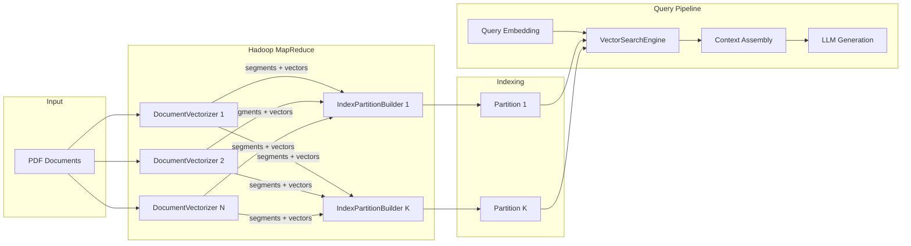

# RAG-LLM-AWS

[](https://www.scala-lang.org/)
[](https://hadoop.apache.org/)
[](https://lucene.apache.org/)
[](LICENSE)

A distributed **Retrieval-Augmented Generation (RAG)** system built with Scala, Apache Hadoop MapReduce, Apache Lucene HNSW indexes, and Ollama for embedding generation and LLM-based answer synthesis.

---

## Architecture



---

## Features

- **Distributed Indexing** — Parallel PDF processing via MapReduce with configurable mappers/reducers
- **Vector Search** — HNSW-based KNN search using Lucene with cosine, Euclidean, or dot-product similarity
- **Query Pipeline** — End-to-end RAG: embed query → search partitions → assemble context → generate answer
- **REST API** — Http4s-based endpoints for querying, searching, and health checks
- **Semantic Analytics** — Vocabulary statistics, semantic neighbors, word analogies, and similarity analysis
- **Cloud Ready** — Deployable on AWS EMR with S3 storage

---

## Tech Stack

| Component | Technology | Version |
|-----------|------------|---------|
| Language | Scala | 3.5.1 |
| Build Tool | SBT | 1.11.x |
| Distributed Computing | Apache Hadoop MapReduce | 3.3.6 |
| Vector Index | Apache Lucene HNSW | 9.10.0 |
| Embeddings & LLM | Ollama | latest |
| HTTP Server | Http4s + Cats Effect | 0.23.x |
| JSON | Circe | 0.14.x |
| PDF Extraction | Apache PDFBox | 2.0.31 |

---

## Quick Start

### Prerequisites

- JDK 17+
- SBT 1.9+
- Ollama running locally with models:
  ```bash
  ollama pull mxbai-embed-large
  ollama pull llama3
  ```

### Build

```bash
sbt clean compile
sbt assembly  # Creates fat JAR for deployment
```

### Run Locally

**1. Build RAG Index from PDFs:**

```bash
hadoop jar target/scala-3.5.1/RAG-LLM-AWS-assembly-1.0.0.jar rag.core.Driver \
  Driver index /path/to/paths.txt /path/to/output mxbai-embed-large COSINE
```

**2. Generate Vocabulary Statistics:**

```bash
hadoop jar target/scala-3.5.1/RAG-LLM-AWS-assembly-1.0.0.jar rag.core.Driver \
  Driver vocabulary /path/to/paths.txt /path/to/output mxbai-embed-large COSINE
```

**3. Run Semantic Analysis:**

```bash
java -cp target/scala-3.5.1/RAG-LLM-AWS-assembly-1.0.0.jar rag.core.Driver \
  Driver analyze /path/to/vocabulary/output dummy dummy
```

**4. Start API Server:**

```bash
export RAG_INDEX_PATH=/path/to/lucene-index
export RAG_API_PORT=8080
sbt "runMain rag.api.SearchApiService"
```

---

## Project Structure

```
RAG-LLM-AWS/
├── src/
│   ├── main/scala/rag/
│   │   ├── core/
│   │   │   ├── Driver.scala              # Entry point for all pipelines
│   │   │   └── Config.scala              # Centralized configuration
│   │   ├── indexing/
│   │   │   ├── DocumentVectorizer.scala  # PDF → segments → embeddings
│   │   │   ├── IndexPartitionBuilder.scala # Builds Lucene HNSW partitions
│   │   │   └── TextChunker.scala         # Text segmentation utility
│   │   ├── search/
│   │   │   ├── VectorSearchEngine.scala  # Search + answer generation
│   │   │   ├── ShardedQueryExecutor.scala # Distributed query execution
│   │   │   ├── ShardQueryMapper.scala    # Query partition mapper
│   │   │   └── ResultMerger.scala        # Merge results from partitions
│   │   ├── api/
│   │   │   └── SearchApiService.scala    # REST API endpoints
│   │   ├── embedding/
│   │   │   ├── OllamaClient.scala        # LLM client for embeddings/chat
│   │   │   └── VectorOps.scala           # Vector math utilities
│   │   ├── analytics/
│   │   │   ├── TokenFrequencyMapper.scala # Vocabulary extraction
│   │   │   ├── EmbeddingAggregator.scala # Token frequency + embeddings
│   │   │   └── SemanticAnalyzer.scala    # Semantic analysis tools
│   │   └── util/
│   │       └── PdfExtractor.scala        # PDF text extraction
│   └── test/scala/rag/
│       ├── indexing/
│       ├── search/
│       ├── analytics/
│       ├── api/
│       └── embedding/
├── outputs/                               # Sample pipeline outputs
│   ├── vocab.csv                          # 4K+ token embeddings (1024-dim)
│   ├── nearest_neighbors.csv              # Semantic neighbors
│   ├── similar_pairs.csv                  # Word similarity scores
│   └── analogy_pairs.csv                  # Vector arithmetic results
├── project/
│   ├── build.properties
│   └── plugins.sbt
├── build.sbt
└── README.md
```

---

## API Endpoints

### Ask (Full RAG)

```bash
curl -X POST http://localhost:8080/api/v1/ask \
  -H "Content-Type: application/json" \
  -d '{
    "question": "What is attention mechanism in neural networks?",
    "limit": 5,
    "embeddingModel": "mxbai-embed-large",
    "completionModel": "llama3"
  }'
```

### Search Only

```bash
curl "http://localhost:8080/api/v1/search?q=neural+networks&limit=5&model=mxbai-embed-large"
```

### Status Check

```bash
curl http://localhost:8080/api/v1/status
```

---

## AWS EMR Deployment

### 1. Upload Bootstrap Script

Upload the bootstrap script to S3 to configure EMR nodes with Ollama.

### 2. Create EMR Cluster

Configure with:
- Instance type: m5.xlarge or larger
- Bootstrap action pointing to your S3 script

### 3. Submit Jobs

```bash
hadoop jar /home/hadoop/RAG-LLM-AWS-assembly-1.0.0.jar rag.core.Driver \
  Driver index s3://your-bucket/paths.txt s3://your-bucket/output mxbai-embed-large COSINE
```

---

## Configuration

| Parameter | Default | Description |
|-----------|---------|-------------|
| `model` | mxbai-embed-large | Ollama embedding model |
| `similarity` | COSINE | Vector similarity (COSINE, EUCLIDEAN, DOT_PRODUCT) |
| `docsPerMap` | 50 | PDFs per mapper task |
| `timeout` | 3600000 | Task timeout in milliseconds |
| `partitions` | 8 | Number of index partitions |

---

## Sample Outputs

The [`outputs/`](outputs/) directory contains pre-computed results from running the pipeline on research papers:

### Word Analogies (`analogy_pairs.csv`)

Demonstrates semantic vector arithmetic (e.g., king - man + woman ≈ queen):

| term_x | term_y | term_z | prediction | score |
|--------|--------|--------|------------|-------|
| king | man | woman | **female** | 0.710 |
| city | country | paris | **amsterdam** | 0.714 |
| day | night | summer | **days** | 0.703 |
| love | hate | good | **nice** | 0.717 |

### Word Similarities (`similar_pairs.csv`)

Cosine similarity between semantically related word pairs:

| first_term | second_term | similarity_score |
|------------|-------------|------------------|
| unity | unify | 0.804 |
| sweet | nice | 0.851 |
| sword | weapon | 0.846 |
| eye | sight | 0.830 |

### Nearest Neighbors (`nearest_neighbors.csv`)

Top-5 semantically similar tokens for each vocabulary term:

| token | similar_1 | cosine_1 | similar_2 | cosine_2 | similar_3 | cosine_3 |
|-------|-----------|----------|-----------|----------|-----------|----------|
| workshop | workshops | 0.93 | session | 0.73 | training | 0.73 |
| incident | incidents | 0.87 | occurred | 0.83 | accident | 0.82 |
| widely | broad | 0.83 | wide | 0.81 | extensively | 0.79 |

### Vocabulary (`vocab.csv`)

Complete vocabulary with 4K+ tokens, frequencies, and 1024-dimensional embeddings.

---

## Demo Video

📺 **[Watch Demo on YouTube](https://youtube.com/YOUR_VIDEO_LINK)**

---

## Author

**Rishabh Rohil**

[](https://linkedin.com/in/YOUR_LINKEDIN)
[](https://github.com/rishabh23rohil)

---

## License

This project is licensed under the MIT License - see the [LICENSE](LICENSE) file for details.
